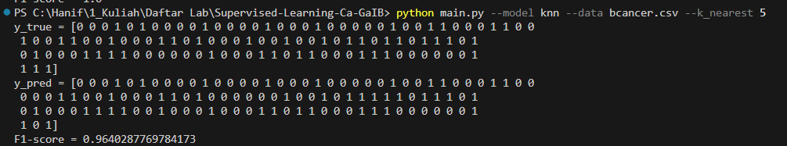

# Supervised-Learning-Ca-GaIB
Implementation of K-Nearest-Neighbors (KNN), Logistic Regression, and ID3 Algorithm using Python.

## Table of Contents
* [General Info](#general-information)
* [Technologies Used](#technologies-used)
* [How to run](#how-to-run)
* [Screenshots](#screenshots)


## General Information
Implementation of K-Nearest-Neighbors (KNN), Logistic Regression, and ID3 Algorithm using Python. KNN and Logistic Regression can be used to solve binary classification problem for  and  dataset. ID3 Algorithm can be used to solve binary classification problem for  dataset


## Technologies Used
- python - version 3.10
- pandas - version 1.4.3
- numpy - version 1.21.6

## How to run
Use this command in the root directory of the repository
```
python main.py --model <model-name> --data <csv-filename> {hyperparameters-of-the-models}
```
Lists of model name available is 'log_reg', 'knn', and 'id_3'.

Lists of data filename available is 'iris.csv', 'bcancer.csv', and 'mushrooms.csv'.

For logistic regression, the hyperparameters are epochs and learning rate. Example:
```sh
python main.py --model log_reg --data bcancer.csv --epochs 2000 --lr 0.1
```

For KNN, the hyperparameters are k_nearest. Example:
```sh
python main.py --model knn --data iris.csv --k_nearest 5
```

For ID3, there are no hyperparameters available. Example:
```sh
python main.py --model id_3 --data mushrooms.csv 
```


## Screenshots
